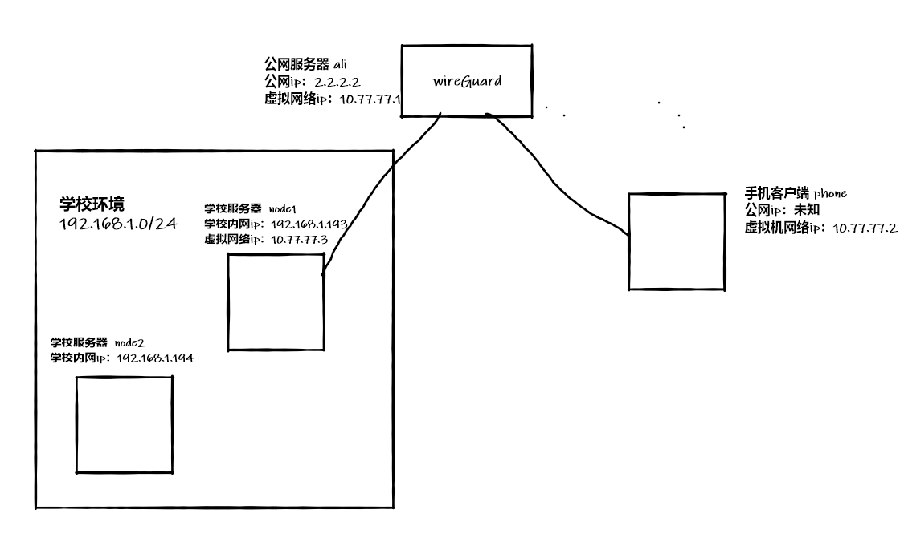
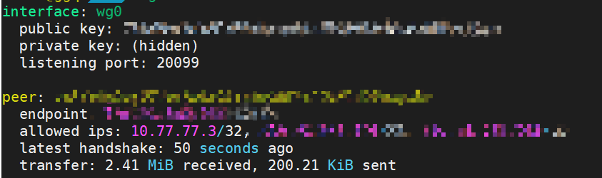
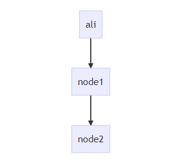
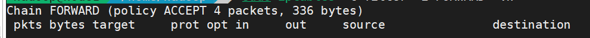

最近研究了一些vpn的技术，因为学校的服务器只能在内网环境下访问，之前已经配置过使用内网穿透，然后使用代理技术来访问的方式，但是内网穿透的方式比较麻烦，随着服务的增多需要配置更多的穿透，所以想要使用更加方便的技术来实现，即使用vpn，使用一个公网服务器用vpn技术来组建虚拟局域网，从而实现连接到VPN之后即可访问内网机器。

这里是用的是比较新的wireGuard，较新且性能较高的vpn，以下配置的过程参考了大佬的文章，https://gobomb.github.io/post/wireguard-notes/

## 目标

整个网络拓扑如下：



想要实现的效果是：在ali上搭建wirdGuard服务，然后使得连入vpn的手机客户端phone能够通过node1访问到内网的服务器node2

<!-- more -->

## 安装

wireGuard需要运行在内核态，虽然配置较为简单，但是安装过程相对来说比较复杂一些，因为需要更新内核，这里使用的是一键安装脚本：

```bash
wget https://raw.githubusercontent.com/yobabyshark/wireguard/master/wireguard_install.sh && chmod +x wireguard_install.sh && ./wireguard_install.sh
```

首先选择升级内核，然后重启机器，然后在安装wireGuard，

完成安装后，wireGuard的配置文件默认是在/etc/wireguard/wg0.conf

在ali上安装完成wirdGuard后，修改一下其配置文件，将监听的端口修改一下，改为服务器开放的端口，

然后使用脚本添加两个客户端，phone和node1，

其中phone的AllowedIPs只需要设置为其本身的虚拟ip即可，即`AllowedIPs = 10.77.77.2/32`

而node1的AllowedIPs需要设置为其本身的虚拟ip加上想要访问的内网机器的ip，即`AllowedIPs = 10.77.77.3/32, 192.168.1.194/32`，这里AllowedIPs在wg启动后，会添加到路由表中，这里node1的AllowedIPs写了192.168.1.194/32，则后续对应source或者对应destination的包都会发往node1的peer。路由表的状态在启动wg后可以通过`route -n`可以看到。同时只有符合AllowedIPs规则的ip包才能够通过这个peer，如果不写的话192.168.1.194/32的话，就算设置了路由表，该包也无法通过这个peer传到node1。

然后启动wg网卡即可

```bash
wg-quick up wg0
```

将node1的配置文件拷贝到node1上，然后同样安装wireGuard，修改一下服务器的端口等信息，启动客户端，如果启动有问题,出现如下日志：

```
argument "suppress_prefixlength" is wrong: Failed to parse rule type
```

则可能是由于iproute太旧导致的，直接使用`yum -y install iproute`升级一下iproute即可，

正常启动客户端后，可以在ali上使用wg来查看当前连接到当前节点的节点，如果能够正常看到一个已经上线的客户端，



## 设置路由

现在在wireGuard中，虚拟网络已经建立了起来，即从ali上直接ping node1的虚拟ip应该是能够ping的通的，因为这条通路是由WireGuard来保证，但是如果想要直接从ali上访问到node2的ip则需要配置路由才能做到，



如果想要在phone访问node2则需要将数据先发往ali，然后由ali转给node1，由node1在内网内传给node2。

则在ali这里需要开启ipv4的包的转发，

```bash
# 临时生效：
$ echo "1" > /proc/sys/net/ipv4/ip_forward

# 永久生效，修改sysctl.conf，增加以下语句
$ net.ipv4.ip_forward = 1
# 重置设置
$ sysctl -p
```

同时需要修改iptables的规则，允许来自wg0和发往wg0的包通过：

```bash
$ iptables -t filter -A FORWARD -i wg0 -j ACCEPT
$ iptables -t filter -A FORWARD -o wg0 -j ACCEPT
```

这时来自phone的包就能正确到达ali，但是这个包的目的地不是ali，且没有对应的路由，这个包还是找不到目的地，需要我们手动的设置路由，让其前往node1

```bash
ip route add 192.168.1.0/24 via 10.77.77.3 dev wg0
```

上面的 设置就是告诉机器目的地是192.168.1.0/24的包下一跳是10.77.77.3，且需要经过wg0转发

这样设置后，由phone到达ali的包就被转发到了node1，在node1中同样需要包的转发， 需要开启系统的ipv4转发功能，然后同样设置iptables，这里如果node1的iptables中filter 表默认是accept的话，则不需要设置以下的语句，如果filter表默认是accpet的话，使用`iptables -t filter -L FORWARD -vn`的输出如下：



如果不是accept的话，需要设置，同时下面的ens192需要替换成机器在ip在局域网中的网卡，下面设置是允许node1上从wg0进到ens192出的包能够流通，同时从ens192进到wg0出的包

```bash
iptables  -t filter  -A FORWARD -i wg0 -o ens192 -j ACCEPT
iptables  -t filter  -A FORWARD  -i ens192 -o wg0 -j ACCEPT
```

上面的设置保证从ali来到node1的包能够被接受到，但是下一步由node1来访问node2还需要特别的配置，需要配置SNAT，即在node1上由iptables来做一个NAT，由node1的ip去访问node2，使用nat能够保证由node2发回的包能够找到回来的路，如果不使用NAT的话，访问node2的包的source ip是10.77.77.1(即ali的虚拟ip，因为包是由ali来转发过来的)，使用下面的语句来设置SNAT，这样就能够保证访问是由node1的内网ip来做的，同时发回的包就能够找到回来的路，在node1的NAT表中查找对应的记录，然后再发回ali

```bash
iptables -t nat -A POSTROUTING -s 10.77.77.0/24 -j MASQUERADE -o ens192
```

上面语句是设置在POSTROUTING chain中的nat表中，增加一条对source ip 是10.77.77.0/24，且去往ens192网卡的包进行NAT，MASQUERADE是SNAT的一种。

这样设置之后就能保证这条线路是通畅的，可以使用一下的命令来验证

## 验证

首先，在ali上使用ping命令来ping node2的ip

然后在node1上使用tcpdump来查看（如果没有的话 需要使用yum -y install tcpdump来安装）

```bash
tcpdump -i wg0 icmp -nn
```

能够看到由`10.77.77.1`发往`192.168.1.194`的包,如果能够看到的话，说明在ali上的路由配置生效了，包能够从ali到达node1，且node1也能够接收到来自ali的包，说明ali到node1的路是通的

同时，在node2上使用以上命令，监听其内网ip所在的网卡，

如果能够看到`192.168.1.193` 到`192.168.1.194`的icmp报文，且`192.168.1.194`能够正常回复，则说明node1的SNAT的配置是成功的，则node1->node2的路也是通的，这样就完成了整体的配置。

这时在手机上下载wirdGuard的客户端，并且导入phone的配置文件，同样设置一下ali上的wirdguard监听的端口，连接vpn，然后输入node2的ip访问node2的服务，如果能够访问成功，则说明整体搭建完毕。


iptables的较好的学习资料：http://www.zsythink.net/archives/tag/iptables/page/2/